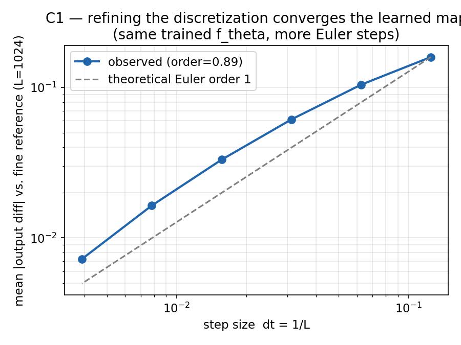
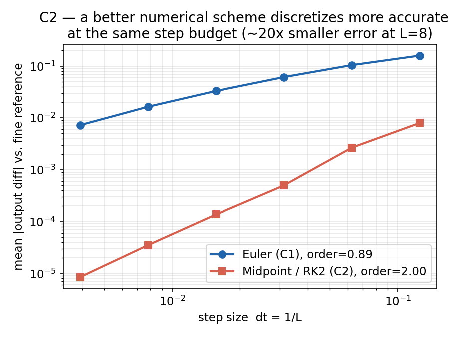
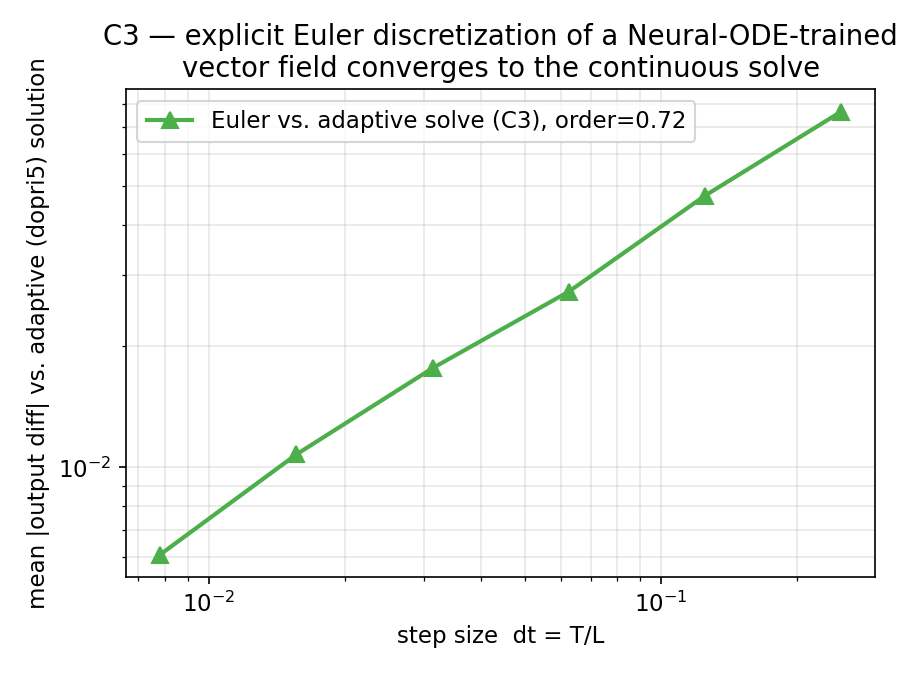
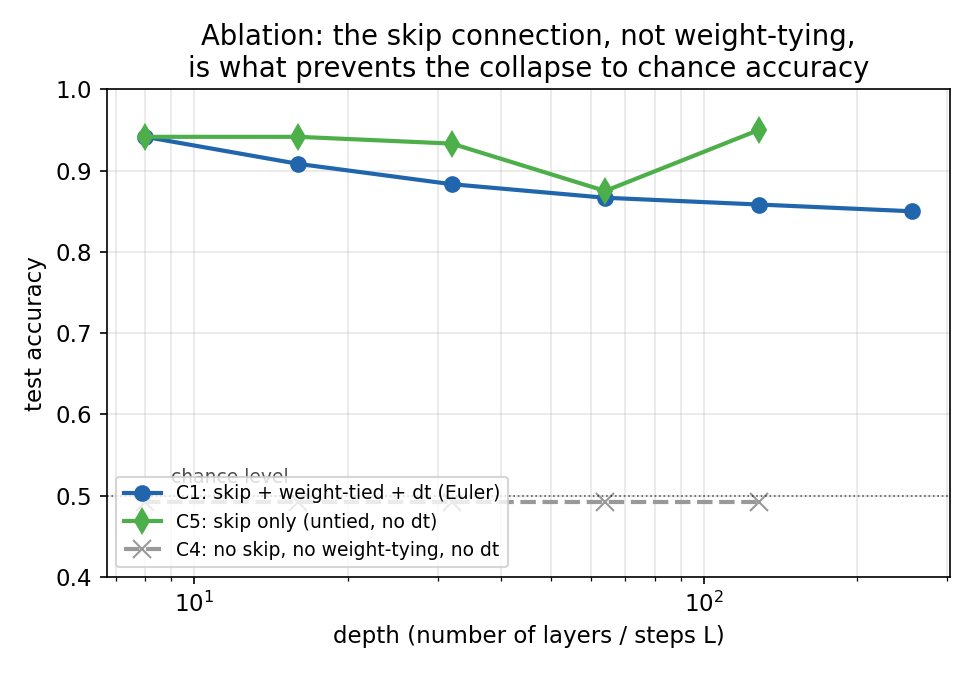

# Are Deep Nets Secretly Solving Differential Equations? Reproducing the Foundational Claim of arXiv:2603.18331



*Same trained network, more integration steps: the output stops changing at the rate the survey's theory predicts. This is the reproduction's central result — details below.*

## The question this paper asks

arXiv:2603.18331, *"Understanding the Theoretical Foundations of Deep Neural Networks through Differential Equations,"* is a **survey**, not a paper with its own experiments. It argues that a wide swath of deep learning — ResNets, Neural ODEs, diffusion models, state-space models — can be understood as instances of one idea: a neural network layer is a **numerical discretization of a differential equation**.

Concretely (the survey's Eq. 1–2), a residual block

```
h_{k+1} = h_k + f_theta(h_k)
```

is exactly the **forward-Euler method** for the ODE `dh/dt = f_theta(h)` with step size `dt = 1`. That correspondence is the load-bearing claim underneath everything else the survey discusses: alternative numerical schemes (midpoint, Runge-Kutta) as better architectures, Neural ODEs as the continuous-depth limit, and stability/control theory as an analysis toolkit.

**Because it's a survey, there is no headline table or number to reproduce.** Every table in the paper summarizes *other people's* architectures or applications — none report the authors' own experiment. So instead of reproducing a result, we test the claim the survey is built on: does treating a residual block as a discretized ODE actually behave like one?

## What "behaving like an ODE" would mean

If `h_{k+1} = h_k + dt·f_theta(h_k)` really is an Euler step, then a network trained with `L` steps should be a coarse approximation of some *fixed* underlying flow. Refining the discretization — more, smaller steps, same trained `f_theta` — should make the network's output converge to that flow, not wander to something unrelated. The forward-Euler method has a known convergence rate: error shrinks proportional to `dt` (order 1). A plain deep network with independent weights per layer has no such structure and no reason to converge to anything as it gets deeper.

That gives four testable claims, run as one experiment tree (`orx/c1...` → children):

| # | Claim | Survey basis |
|---|---|---|
| **C1** | Residual block = forward-Euler discretization | Eq. 1–2 |
| **C2** | A higher-order scheme (midpoint/RK2) discretizes more accurately at the same step budget | §3.1.1 (PolyNet, FractalNet) |
| **C3** | A Neural ODE (adaptive continuous solver) is the limit that Euler discretization approaches | §3.1 (Neural ODEs / NDEs) |
| **C4** (negative control) | A plain deep stack — no skip connection, no shared weights — should **not** show this convergence | motivates the whole survey (He et al. 2015) |
| **C5** (ablation) | Isolates *which* missing ingredient causes C4's outcome: restore only the skip connection | — |

## Setup

All four experiments run the same pipeline on **CPU only** (4-core laptop, no GPU) — deliberately downscaled from anything in the survey's cited literature, since the claim being tested is architectural, not about scale:

- **Task**: two-moons binary classification (400 points, `sklearn.datasets.make_moons`), embedded to an 8-dim hidden state.
- **Vector field**: a small 2-layer MLP `f_theta`, shared (weight-tied) across all discretization steps — the necessary condition for "more steps" to mean "finer approximation of the same flow" rather than "a different, bigger model."
- **Training**: Adam, 400 full-batch epochs, fixed seed.

```python
# model.py — the block under test (C1)
class EulerODEBlock(nn.Module):
    def __init__(self, dim, hidden=32, T=1.0):
        super().__init__()
        self.f = VectorField(dim, hidden)   # shared across every step
        self.T = T

    def forward(self, h0, num_steps):
        dt = self.T / num_steps
        h = h0
        for _ in range(num_steps):
            h = h + dt * self.f(h)          # Eq. 2 of the survey
        return h
```

Each claim changes exactly this block (and nothing else in the training loop):

- **C1**: the block above, trained at depth `L=8`.
- **C2**: `h = h + dt * f(h + dt/2 * f(h))` — midpoint/RK2 step.
- **C3**: `torchdiffeq.odeint_adjoint` (dopri5) replaces the step loop entirely — a genuinely continuous solve.
- **C4**: independent, untied weights per layer, no `+`, no `dt` — three changes from C1 at once.
- **C5**: independent, untied weights per layer, but the `+` (skip connection) restored — isolates one change at a time.

## C1 — the headline result

Train once at depth 8. Then, **without retraining**, re-run the same `f_theta` at finer step counts (16 → 256) and compare its output to a very fine reference (`L=1024`, a proxy for the true continuous flow).

| L (steps) | dt | mean output diff vs. L=1024 | test acc |
|---|---|---|---|
| 8 | 0.125 | 0.159 | 0.942 |
| 16 | 0.0625 | 0.104 | 0.908 |
| 32 | 0.0313 | 0.061 | 0.883 |
| 64 | 0.0156 | 0.033 | 0.867 |
| 128 | 0.0078 | 0.016 | 0.858 |
| 256 | 0.0039 | 0.0072 | 0.850 |

The diff shrinks smoothly as `dt → 0` — fitting a line to `log(diff)` vs. `log(dt)` gives an **empirical convergence order of 0.89**, close to forward-Euler's theoretical order of 1 (dashed line, figure above). The network isn't just "deep and residual" — refining its step count behaves like refining a numerical integrator.

## C2 — a better integrator, less error, same weights

If C1 is really Euler's method, swapping in a *better* method should reduce error at a fixed step count — that's the entire point of numerical schemes with different orders.



| | C1 (Euler) | C2 (Midpoint/RK2) |
|---|---|---|
| empirical order | 0.89 | **2.00** |
| diff at L=8 | 0.159 | **0.0080** (20× smaller) |
| diff at L=256 | 0.0072 | **0.0000085** (850× smaller) |

RK2's theoretical order is exactly 2 — the measured 1.999 is about as clean a confirmation as a toy-scale experiment produces. This is the survey's §3.1.1 claim (PolyNet, FractalNet: better discretizations → more accurate/expressive networks at the same depth) made numeric.

## C3 — the continuous limit

The survey frames Neural ODEs as what a ResNet approaches as depth → ∞. We trained `f_theta` directly with an adaptive ODE solver (no discrete steps at all during training), then asked: does discretizing *that* vector field with plain Euler converge back to the solver's answer?



Yes — diff to the adaptive solution shrinks from 0.077 (4 steps) to 0.0061 (128 steps), empirical order 0.72 (a bit below 1, plausibly a noise floor set by the adaptive solver's own `rtol=1e-3`). Discrete Euler stacks (C1) and continuous Neural ODEs (C3) are two views of the same object, converging toward each other from opposite directions.

## C4 and C5 — negative control, then an ablation to find out what it actually showed

Everything above could, in principle, be an artifact of "any sufficiently regular deep network smooths out as it gets deeper." C4 removes the residual/weight-tying structure — independent weights per layer, no skip connection, no `dt` — and repeats the same depth sweep.

**Every depth from 8 to 128 collapses to exactly 49.17% test accuracy** — chance level on this balanced task — with consecutive-depth output diffs near floating-point noise (~1e-6). That's not "no clean convergence law," it's outright training failure.

But C4 changes *three* things relative to C1 at once (skip, weight-tying, `dt`), so on its own it cannot say which change caused the collapse — a control that changes three variables isn't a clean control. **C5** isolates one: restore only the skip connection (still untied weights, still no `dt`) and repeat the depth sweep.



| Depth | C1 (skip + tied + dt) | C5 (skip only) | C4 (neither) |
|---|---|---|---|
| 8 | 0.942 | 0.942 | 0.492 |
| 16 | 0.908 | 0.942 | 0.492 |
| 32 | 0.883 | 0.933 | 0.492 |
| 64 | 0.867 | 0.875 | 0.492 |
| 128 | 0.858 | 0.950 | 0.492 |

C5 trains successfully at every depth — comparable to C1, nothing like C4's collapse. **The skip connection alone is what restores trainability**, matching He et al. (2015)'s original motivation for ResNets; weight-tying was not the ingredient responsible for C4's failure. (C5's own consecutive-depth diffs don't shrink cleanly with depth — expected, since untied weights mean there's no shared vector field for more layers to be a finer sampling *of*; that structure is what weight-tying buys you, and it's what C1/C2's clean power-law convergence specifically requires.)

## Assessment

| Claim | Paper's claim | Observed (this setup) | Assessment |
|---|---|---|---|
| C1 | ResNet block ≡ forward-Euler ODE step | order 0.89 (theory: 1) | **aligned** |
| C2 | Better numerical scheme → more accurate discretization | order 2.00 (theory: 2), 20–850× lower error | **aligned** |
| C3 | Neural ODE = continuous-depth limit of discrete stack | order 0.72; smooth convergence to adaptive solve | **aligned** |
| C4 | (negative control, not a paper claim) | plain stack (3 changes at once) collapses to chance accuracy at all depths | **inconclusive under this setup alone** — conflates skip connection and weight-tying |
| C5 | (ablation, not a paper claim) | skip-only stack trains at C1-level accuracy at all depths | **isolates the cause**: skip connection, not weight-tying, prevents C4's collapse |

Since the source is a survey with no original numbers, "paper's result" above is the analytical statement (Eq. 1–2 and the surrounding discussion), not a number — we're checking that a stated mathematical equivalence has the empirical consequences it should, not matching a reported metric.

## Scope and what a fuller reproduction would add

- **Toy scale, deliberately.** Two-moons/2D state, CPU-only, ~400 training epochs. The correspondence being tested is architectural (holds at any scale by construction), but a fuller pass would replicate it on the actual benchmarks the survey's cited works use (e.g., CIFAR-10 ResNets, MNIST ODE-Nets) to confirm the effect survives real image data and deeper/wider networks.
- **Single seed.** All four runs use `seed=0`; no variance estimate across seeds.
- **C3's convergence order (0.72) undershoots theory (1)** more than C1 does — worth checking whether this is the adaptive solver's `rtol` acting as a noise floor, or a genuine effect of training against a stochastic-in-practice adjoint gradient. Not resolved here.
- **Not attempted**: layer-level claims (Deep SSMs / HiPPO), stability/control-theory tooling (§4), and the generative-model (diffusion/flow) instances of the model-level claim — all out of scope for a CPU-only, single-session reproduction of the *foundational* claim.

## Experiment branches

- [`orx/c1-resnet-as-forward-euler-discretization-2`](https://github.com/Dennis-J-Carroll/understanding-the-theoretical-foundations-of-dee/tree/orx/c1-resnet-as-forward-euler-discretization-2) — C1 baseline
- [`orx/c2-midpoint-rk2-discretization-vs-euler`](https://github.com/Dennis-J-Carroll/understanding-the-theoretical-foundations-of-dee/tree/orx/c2-midpoint-rk2-discretization-vs-euler) — C2
- [`orx/c3-neural-ode-adaptive-solve-vs-euler-discretiza`](https://github.com/Dennis-J-Carroll/understanding-the-theoretical-foundations-of-dee/tree/orx/c3-neural-ode-adaptive-solve-vs-euler-discretiza) — C3
- [`orx/c4-plain-non-residual-stack-negative-control`](https://github.com/Dennis-J-Carroll/understanding-the-theoretical-foundations-of-dee/tree/orx/c4-plain-non-residual-stack-negative-control) — C4
- [`orx/c5-skip-connection-only-ablation-untied-weights`](https://github.com/Dennis-J-Carroll/understanding-the-theoretical-foundations-of-dee/tree/orx/c5-skip-connection-only-ablation-untied-weights) — C5
