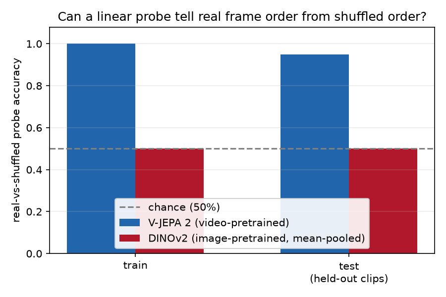

# Reproducing V-JEPA 2's motion-vs-appearance claim (arXiv:2506.09985)

**Verdict: Reproduced (directional proxy, small-N).**

## The claim

V-JEPA 2 (Meta FAIR, [arXiv:2506.09985](https://arxiv.org/abs/2506.09985)) is a
self-supervised *video* encoder: it predicts masked spatio-temporal patches in
representation space, trained on over a million hours of video. Its headline
probe-based evaluation (Sec 5.1) shows a large accuracy gap over image-style
encoders specifically on the **motion-centric** benchmark (Something-Something
v2), and a much smaller gap on the **appearance-centric** one (ImageNet):

| Benchmark | V-JEPA 2 ViT-g | Best other frozen encoder |
|---|---|---|
| SSv2 (motion) | 77.3% | InternVideo2-1B 69.7%, PEcoreG 55.4% |
| ImageNet (appearance) | 84.6% | close to peers |

The claim under test: video pretraining specifically buys **order/motion
sensitivity** that image pretraining does not — not just "better features in
general."

## Why this claim, downscaled this way

SSv2/Jester (the paper's own motion benchmarks) require a signed license
agreement, and the paper's headline model is a 1B-parameter ViT-g. Both are
out of reach for a CPU-only, license-clean reproduction. Rather than skip the
claim, this reproduction isolates the same mechanism directly: instead of
action-label classification, we test whether a linear probe on frozen pooled
features can tell a clip's **real frame order** from a **randomly shuffled**
version of the exact same 64 frames. This requires no action labels, no gated
data, and lets the underlying mechanism (joint spatio-temporal attention vs.
independent per-frame encoding) speak directly, rather than through the lens
of a specific downstream task.

## Method

- **Models**: `facebook/vjepa2-vitl-fpc64-256` (real released checkpoint, MIT
  license, ~300M params) vs. `facebook/dinov2-small` (image encoder, frames
  encoded independently then mean-pooled across all 64 — mean-pooling a fixed
  set is provably invariant to the order it was visited in).
- **Data**: `nateraw/kinetics-mini` (public HF dataset, no license gate; also
  the dataset used in V-JEPA 2's own HF model-card usage example). 5 action
  classes (archery, bowling, flying_kite, high_jump, marching).
- **Task**: for each clip, sample 64 frames; build a "real" version and a
  "shuffled" version (same 64 frames, permuted order, fixed seed per clip);
  pool each encoder's frozen features; train a linear probe (logistic
  regression) to classify real-vs-shuffled from the pooled feature alone.
- **N**: 20 clips (10 probe-train / 10 held-out probe-test, disjoint videos,
  2 per class), each contributing one real + one shuffled example &rarr; 20
  probe-train / 20 probe-test examples per encoder.
- **Compute**: `local` backend (CPU), per the reproducer's choice — a
  learning-focused run, not a speed run.

## Results

| | V-JEPA 2 | DINOv2 baseline |
|---|---|---|
| Probe train accuracy | 100.0% | 50.0% |
| **Probe test accuracy (held-out)** | **95.0%** | **50.0%** |
| Real-vs-shuffled feature distance | mean cosine distance 0.086 | max\|diff\| = 9.5e-7 |

The baseline's max\|real&nbsp;&minus;&nbsp;shuffled\| feature difference of
9.5&times;10-7 is float32 rounding noise — i.e. the features are
numerically identical, exactly as the mean-pooling argument requires. This is
checked directly in the run, not assumed. V-JEPA 2's features differ by a real
margin (mean cosine distance 0.086), and a linear probe recovers that
difference at 95% held-out accuracy.

Total compute: 4975.9s (~83 min) CPU wall-clock, 40 V-JEPA 2 forward passes
(64 frames &times; 256&times;256 each) + 40 lightweight DINOv2 passes.

## Interpretation

DINOv2 encodes each frame independently, then mean-pools: `pooled =
mean(encode(frame_1), ..., encode(frame_64))`. A mean over a set cannot depend
on the order the set was visited in — order isn't an input to that
computation. So DINOv2's real and shuffled pooled features must be identical
for any permutation, as a matter of arithmetic, and a probe cannot beat chance
separating identical points with opposite labels (not even on the training
set it memorizes — hence exactly 50.0% train accuracy, not just test).

V-JEPA 2 encodes all 64 frames jointly through self-attention with positional
structure (3D-RoPE), so permuting order changes what every patch attends to —
there is no algebraic reason for its pooled output to be order-invariant.
Whether it *actually* is order-sensitive is empirical, and the probe measures
it directly: 95% held-out accuracy and a real (non-floating-point-noise)
feature distance.

**What would falsify this claim at this scale**: if V-JEPA 2's held-out
accuracy had also landed near 50% and its feature distance had also been
~1e-6, matching the baseline's exact-invariance signature.

## Substitutions vs. the paper

| Paper | This reproduction | Why |
|---|---|---|
| V-JEPA 2 ViT-g, ~1B params | V-JEPA 2 ViT-L, ~300M params | Smallest released checkpoint; real architecture and real weights, not a toy |
| SSv2 / Jester (registration-gated) | nateraw/kinetics-mini (public) | Gated datasets require a signed license agreement |
| Action classification, full val sets, ~174/27 classes | Real-vs-shuffled frame-order probe, N=20 clips, 5 classes | Isolates the same mechanism directly, at CPU scale |
| Attentive probe, large eval sets | Linear probe, 20 held-out examples | Proportionate to small-N; directional, not a tight estimate |

Not attempted: SSv2/Jester probe accuracy at the paper's own scale, VidQA
(needs an 8B-parameter LLM aligner), robot planning (needs a Franka arm +
Droid dataset), Epic-Kitchens-100 action anticipation.

## Limitations

- N=20 test examples is small (95% = 19/20 correct); not a statistically
  powered estimate, though the baseline's exact-chance result is not subject
  to sample-size noise (it's a mathematical identity, empirically confirmed).
- Single seed, single fixed permutation per clip.
- Proxy task (order-detection), not the paper's own action-classification
  benchmark — related mechanism, not an identical task.

## Provenance

- Code, fixed configuration, and evaluation method:
  [`orx/v1-v-jepa-2-frozen-feature-temporal-order-sensit`](https://github.com/Dennis-J-Carroll/understanding-the-theoretical-foundations-of-dee/blob/orx/v1-v-jepa-2-frozen-feature-temporal-order-sensit/run_probe.py)
  (`run_probe.py`). Run command is a fixed contract on that branch — see the
  repository README for the exact command.
- Tutorial notebook (frozen results embedded, no rerun required; optional
  live GPU lab):
  [`notebooks/vjepa2_temporal_order_reproduction.py`](../../notebooks/vjepa2_temporal_order_reproduction.py)
- Two earlier attempts on the same experiment node failed on environment
  setup (this environment's `transformers` version hard-requires
  `torchvision` for its image/video processors, which wasn't installed) and
  were repaired in place by re-implementing each processor's documented
  preprocessing directly in NumPy/PIL — same branch history, not separate
  experiments.
